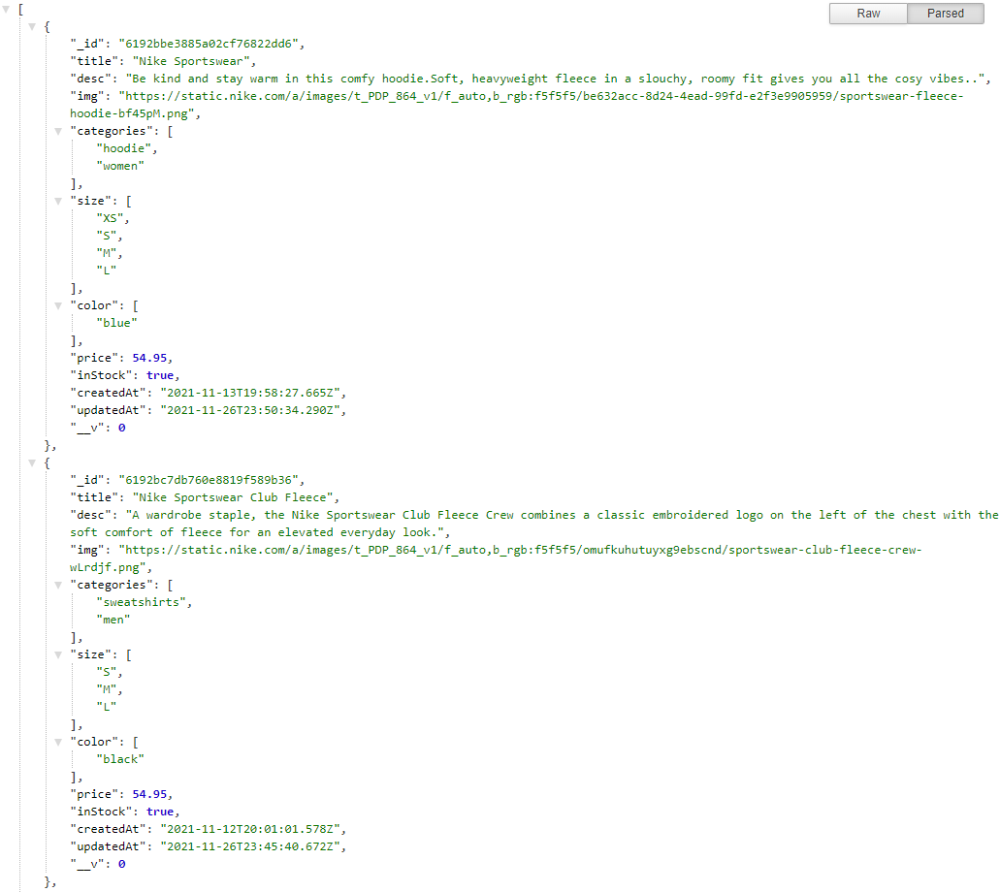

# e-commerce-api

## Welcome! 👋

LOGO-ESHOP is a fullstack e-commerce web app built with the MERN stack (MongoDB, Express, ReactJS and NodeJS). This is the server side of the e-commerce web app.

## Build with ⚙️

This is the server side of the e-commerce web app. The server side is built with Express and NodeJS. JWT is used for user authentication and user password is encrypted with CryptoJS for security. All data are stored in MongoDB.

## Screenshots 📷

## Link 🔗

Client:
[Click Me!](https://logo-eshop.netlify.app/)

Server: (Example: fetching products)
[Click Me!](https://logo-eshop.herokuapp.com/api/v1/products)
